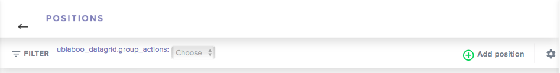
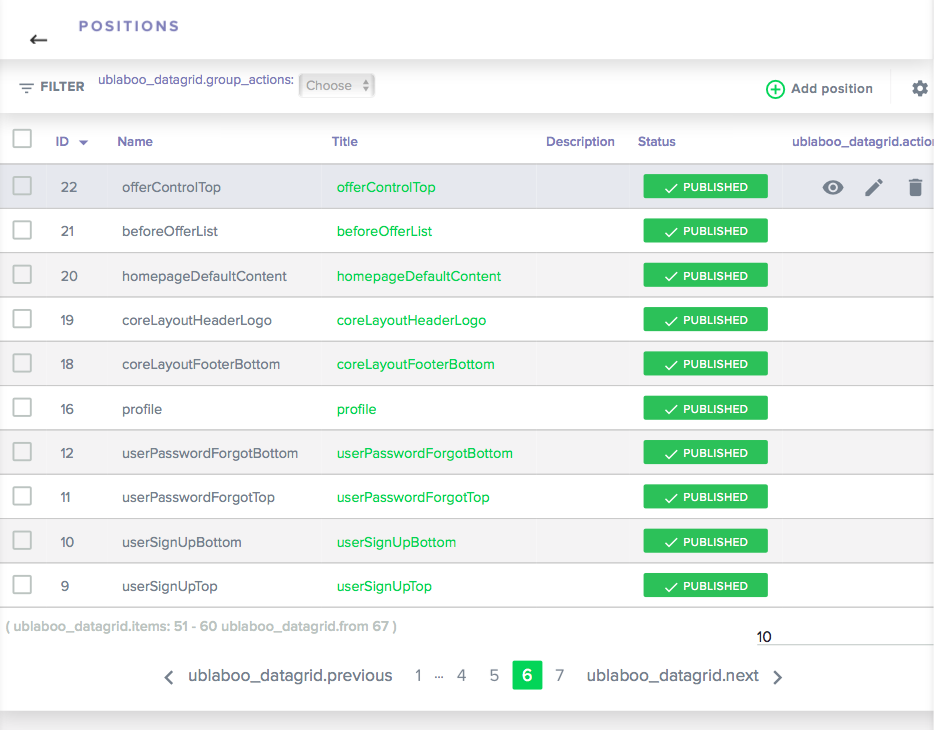
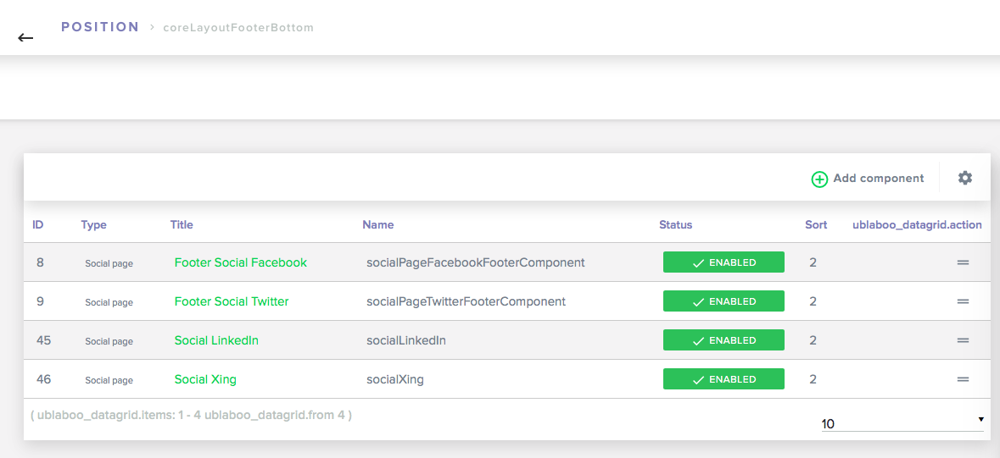

# Správa Pozícií

Účelom pozícií v systéme je ponúknuť flexibilitu zobrazovania obsahu na stránke. Do pozície sa vkladajú komponenty, ktoré zobrazujú istý druh informácií podľa svojo účelu. Pozícia "zastrešuje" komponenty v nej umiestnené.


## Vytvorenie

Pozíciu vytvoríme jednoduchým zápisom v akejkoľvek šablone (presenter, komponenta).

**syntax**
```
{position NazovPozicie}
```

Následne, aby sa pozícia zobrazila v administrácií a bolo možné s ňou pracovať je potrebne buď:

- návštiviť podstránku na front-ende, kde bude pozícia použitá (nastane reload stránky)
- pridať pozíciu v administrácii pomocou tlačidla **Add Position**

**Add Position**



## Spravovanie cez Administráciu

Pozície je možné spravovať v administrácií. Prehľad pozicií je štrukturovaný v prehľadnej tabuľke.

**Tabuľka s prehľadom pozícií**



Priamo z prehľadu je možné zobraziť komponenty, ktoré obsahuje zvolená pozícia.

**Tabuľka s prehľadom komponent určitej pozície**


