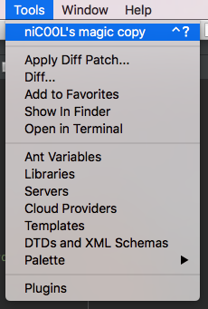

# Preťažovanie šablón

**Preťažovanie šablón** je spôsob ako je možné docieliť zmenu štruktúry kódu oproti nadradenej šablone. Tým získame úplnú kontrolu nad renderovaním šablón presentra, komponenty, formulároveho poľa.

WAMEIS je postavený na modulárnom prístupe vývoja. To znamená, že každý projekt je poskladaný z malých modulárnych častí - **balíčkov**.
Balíčky sa inštalujú pomocou [composer](https://getcomposer.org). Všetky balíčky sú umiestné v priečinku `/vendor`

## Úrovne preťažovania

Celý mechanizmus preťažovania je navrhnutý tak, že môže nastávať v dvoch úrovniach:

1. **theme úroveň** - šablony témy
2. **app úroveň** - špecifické šablony, ktoré sa vzťahujú k projektu


## Čiastočné preťaženie

?> _TODO_ popísať využitie premennej $defaultTemplate


## Postup

Postup je jednoduchý. Majme balíček `UserModule`, ktorý obsahuje šablonu pre podstranku s prihlasovaním.


**Cesta k šablone** v balíčku vo vendor prečinku

```
/vendor/wame/UserModule/presenters/templates/Sign/in.latte

```

Pri preťažení šablony je potrebné vytvoriť novú šablonu s rovnakým názvom. V našom prípade to bude šablona `in.latte`.
Umiestníme je do priečinka `/app` pričom je dôležité zachovať vnutornú štruktúru cesty

**Cesta k preťaženej šablone** v app priečinku bude nasledovná

```
/app/UserModule/presenters/templates/Sign/in.latte

```

## Tip

Existuje plugin **niC00L's magic copy** do IDE Netbeans, ktorý zjednodušuje proces vytvorenia novej (preťažujúcej) šablony. Stačí otvoriť orginálnu šablonu z balíčka a následne vybrať z ponuky `Tools->niC00L's magic copy`



?> Autorom pluginu <a href="../sources/nicool-copymodule.nbm" download>niC00L' magic copy</a>  je [niC00L](https://github.com/niC00L) 